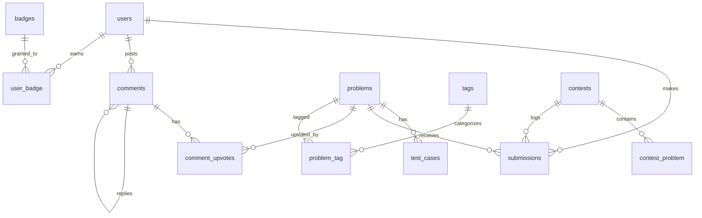
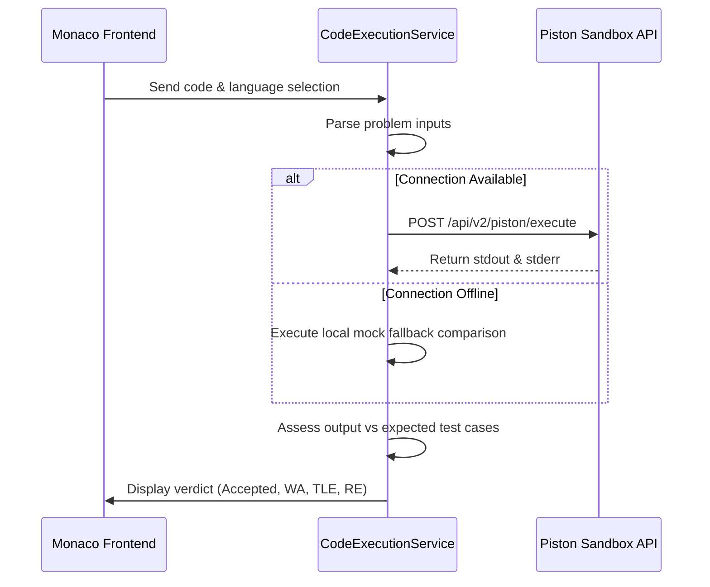

# CodeSolve Platform

CodeSolve is a complete Laravel 11 online competitive programming and problem-solving web application. This platform provides users with LeetCode/GeeksforGeeks-style practice workspace, real-time code executions in multiple languages, dynamic contests, nested discussion threads, leaderboards, and an advanced admin management panel.

---

## 1. Tech Stack

- **Backend**: Laravel 11 (PHP 8.2+)
- **Frontend**: Blade Templates, Tailwind CSS, Alpine.js, Monaco Editor, Chart.js
- **Database**: MySQL (production), SQLite (local testing)
- **Sandbox Execution**: Piston API (supports C++, Java, Python, JavaScript)
- **Deployment**: Configured for local serve and Vercel serverless environment

---

## 2. Features

### User Authentication & Dashboard
- **Standard Authentication**: Register, login, password resets, and session management using Laravel Breeze.
- **Enhanced Profile**: Custom user roles (`admin` vs `user`), profile picture uploads, coding streaks, point tracking, and achievement badges.
- **Dynamic Stats Dashboard**: Solved difficulty distribution graphs powered by **Chart.js** (Easy, Medium, Hard), tag progress trackers, paginated submission history, and unlocked achievements.

### Problems & Monaco Workspace
- **Coding Problems Catalog**: Lists practice problems with search, difficulty levels, and concept tag filters.
- **LeetCode-like Editor Panel**: Split-screen workspace. Left pane shows instructions, limits, and examples. Right pane integrates a **Monaco Editor** with autocomplete and parameter hints.
- **Live Code Execution**: Supports C++, Java, Python, and JavaScript. Uses **Piston API** for sandboxed execution, with a custom offline mock parser fallback.
- **Submissions Hub**: Tracks outcomes (`Accepted`, `Wrong Answer`, `Time Limit Exceeded`, `Runtime Error`, `Compile Error`) with execution time and memory footprint.

### Discussion & Social Interactions
- **Nested Comments**: Threaded replies underneath each coding problem.
- **Engagement**: Upvoting/downvoting comments and admin moderation tools.

### Contests Hub
- **Contest Scheduler**: Upcoming, active, and past coding contests.
- **Countdown Screens**: Live timers powered by Alpine.js.
- **Leaderboards**: Stands dynamically updated based on penalty time and weight of solved problems.

### Admin Panel
- **Analytics Dashboard**: Active problems count, active contests, total users, and submissions.
- **Management Tools**:Promote/demote user roles, delete accounts, global submission logs stream, and full CRUD panels for problems, test cases, and contests.

---

## 3. Database Schema



---

## 4. Code Execution Workflow



---

## 5. LeetCode-Style Auto-Driver & Monaco Autocomplete

We have implemented an automated code wrapping and signature-based code driver engine:
- **Signatures System**: Problem definitions in `config/signatures.php` map arguments, input types, output mapping, and return signatures for all 54 seeded problems.
- **Dynamic Starter Templates**: Monaco Editor automatically generates and loads a clean template containing the target `Solution` class and method declaration in C++, Java, Python, and JavaScript when loading a problem.
- **Wrapped Execution**: When code is executed or submitted, `SignatureService` silently wraps the user's solution with standard input/output parsing driver code before dispatching to the sandbox.
- **Autocomplete & IntelliSense**: Custom Monaco Editor script integrations in `resources/views/problems/show.blade.php` support parameter hints, word completions, and trigger characters.

---

## 6. How to Run Locally

### Prerequisites
1. PHP 8.2 or 8.3
2. Composer
3. Node.js & NPM
4. MySQL Server

### Startup Commands

1. **Clone and Install dependencies**
   ```bash
   composer install
   npm install
   ```

2. **Configure Environment**
   Duplicate `.env.example` to `.env` and set:
   ```env
   DB_CONNECTION=mysql
   DB_HOST=127.0.0.1
   DB_PORT=3306
   DB_DATABASE=codesolve
   DB_USERNAME=root
   DB_PASSWORD=
   ```

3. **Migrate and Seed Database**
   ```bash
   php artisan migrate:fresh --seed
   ```

4. **Build Frontend Assets**
   ```bash
   npm run build
   ```

5. **Start Dev Server**
   ```bash
   php artisan serve
   ```

### Default Credentials
- **Admin**: `admin@codesolve.com` | Password: `password`
- **User**: `user@codesolve.com` | Password: `password`

---

## 7. Running Tests

The application includes 73 unit and feature tests covering signature templates, auto-drivers, contests, and authentication guards.

Run tests using:
```bash
php artisan test
```

---

## 8. Vercel Deployment Configuration

We have configured the application for seamless deployment to **Vercel** via Serverless Functions:

### Added Files
1. **`api/index.php`**: Created inside a new `/api` directory to act as the serverless execution entrypoint, importing the root `public/index.php`.
2. **`vercel.json`**: Configured the community PHP runtime wrapper `vercel-php@0.7.3` and routed static build assets directly to Vercel's CDN, forwarding all dynamic traffic to the API gateway.

### Steps to Deploy
1. **Import** the repository to Vercel.
2. **Framework Preset**: Select **Other**.
3. **Build & Development Settings**:
   - Set **Build Command** to `npm run build`.
   - Set **Output Directory** to `public`.
4. **Environment Variables**:
   Configure these parameters in Vercel settings:
   - `APP_KEY`: Standard Laravel application key.
   - `DB_CONNECTION`: `mysql` (use an external Cloud DB like AWS RDS, Supabase, or TiDB).
   - `DB_HOST` / `DB_PORT` / `DB_DATABASE` / `DB_USERNAME` / `DB_PASSWORD`: Connection parameters.
   - `FILESYSTEM_DISK`: `s3` (recommended for profile picture uploads since Vercel uses a read-only filesystem).
